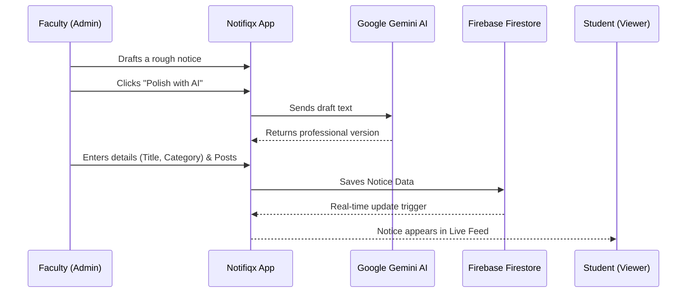

# Notifiqx - Project Report

## 1. Brief: Problem Statement & Solution

### Problem Statement
In many colleges, official communication relies on chaotic WhatsApp groups. Important circulars (exams, deadlines, placements) get buried under hundreds of student messages, leading to misinformation and missed opportunities. There is no easy way to search for old notices or verify the authenticity of a forwarded message.

### Proposed Solution
**Notifiqx** is a centralized, role-based digital notice board designed specifically for educational institutions. It brings clarity to campus communication by providing a single source of truth.
*   **For Faculty (Admins):** A structured dashboard to post notices with categories (Exam, Urgent, Event), ensuring critical info stands out.
*   **For Students (Viewers):** A distraction-free feed where notices are verified, categorized, and easily searchable.
*   **AI Integration:** Built-in Google Gemini AI helps faculty rewrite messy drafts into professional notices instantly.

---

## 2. Opportunities & Differentiation

### How is it different from existing ideas?
Most colleges use either:
1.  **WhatsApp/Telegram Groups:** Unstructured, noisy, and prone to spam.
2.  **Legacy ERP Systems:** Clunky, non-responsive, and require complex logins just to check a simple circular.

**Notifiqx bridges this gap by being:**
*   **Open yet Secure:** Public landing page for general info, but role-gated content for sensitive notices.
*   **AI-Enhanced:** Unlike standard portals, Notifiqx actively assists the creator using Generative AI.
*   **Visual-First:** Uses a modern, "Instagram-like" card layout which appeals to the Gen-Z student demographic, unlike boring tabular ERP lists.

### How will it solve the problem?
*   **Eliminates Noise:** Only authorized Admins can post. Students can only view.
*   **Ensures Trust:** Every notice comes from a verified account, eliminating "fake news" and rumors.
*   **Accessibility:** Fully responsive web app works perfectly on mobile phones, where students spend most of their time.

---

## 3. List of Features

*   **Role-Based Access Control (RBAC):** Distinct dashboards for Super Admins, Faculty (Admins), and Students (Viewers).
*   **Real-Time Feed:** Notices appear instantly without page reloads (powered by Firestore).
*   **AI Notice Rewriter:** "Polish with AI" button uses Google Gemini to fix grammar and tone.
*   **Rich Media Support:** Admin can attach images to notices (lightbox viewing supported).
*   **Smart Filtering:** Filter notices by category (Urgent, Exam, Placement) or date.
*   **Emergency Alerts:** Special UI treatment for "Urgent" notices to grab immediate attention.
*   **Direct Contact:** Integrated "Contact Us" form with EmailJS support.

---

## 4. Google Technologies Used

1.  **Google Firebase Authentication:** For secure, seamless user login and session management.
2.  **Google Cloud Firestore:** As the real-time NoSQL database to store users and notices.
3.  **Google Gemini API (Generative AI):** For the "Rewrite with AI" feature that polishes notice content.
4.  **Google Fonts:** Used `Inter` and `Monument Extended` for modern typography.
5.  **Project IDX (Development):** Building and debugging within Google's cloud-based development environment.

---

## 5. Process Flow Diagram



---

## 6. Architecture Diagram

```mermaid
graph TD
    Client[Client Browser (React/Vite)]
    
    subgraph "Google Cloud / Firebase Services"
        Auth[Firebase Auth]
        DB[(Cloud Firestore)]
        Storage[Firebase Storage]
    end
    
    subgraph "AI Services"
        Gemini[Google Gemini API]
    end

    Client -->|Authenticates users| Auth
    Client -->|Reads/Writes Notices| DB
    Client -->|Uploads Images| Storage
    Client -->|Sends Draft Text| Gemini
    Gemini -->|Returns Polished Text| Client
```

---

## 7. Future Development

*   **Mobile Application:** Wrap the React app into a native Android/iOS app using Capacitor.
*   **Push Notifications:** Integration with Firebase Cloud Messaging (FCM) for instant device alerts.
*   **Event Calendar Sync:** "Add to Google Calendar" button for notices with dates.
*   **Department Isolation:** Advanced filtering so CS students only see CS notices.
*   **Multilingual Support:** Use Gemini to translate notices into local languages automatically.
